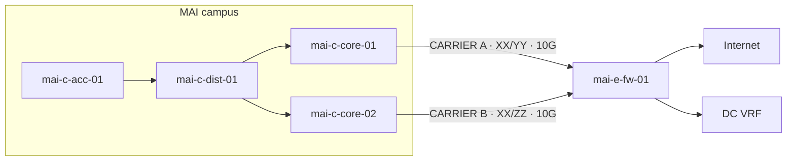
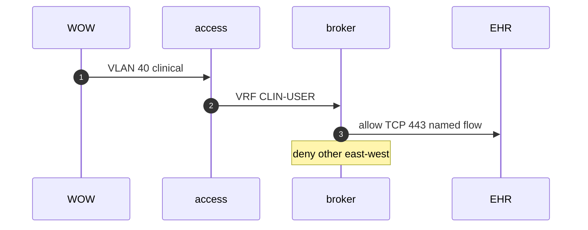
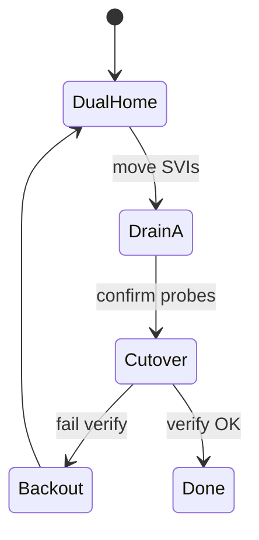

# Mermaid patterns

## L3 failure domains

```mermaid
flowchart LR
  subgraph site[MAI campus]
    a[mai-c-acc-01] --> d[mai-c-dist-01]
    d --> c1[mai-c-core-01]
    d --> c2[mai-c-core-02]
  end
  c1 -->|CARRIER A · XX/YY · 10G| edge[mai-e-fw-01]
  c2 -->|CARRIER B · XX/ZZ · 10G| edge
  edge --> inet[Internet]
  edge --> dc[DC VRF]
```

## Packet walk

```mermaid
sequenceDiagram
  autonumber
  participant WOW
  participant ACC as access
  participant FW as broker
  participant EHR
  WOW->>ACC: VLAN 40 clinical
  ACC->>FW: VRF CLIN-USER
  FW->>EHR: allow TCP 443 named flow
  Note over FW: deny other east-west
```

## Cutover state

```mermaid
stateDiagram-v2
  [*] --> DualHome
  DualHome --> DrainA: move SVIs
  DrainA --> Cutover: confirm probes
  Cutover --> Backout: fail verify
  Cutover --> Done: verify OK
  Backout --> DualHome
```

Keep subgraph titles as site or VRF names. Avoid rainbow styles; use
`classDef` only for NEW vs EXISTING vs REMOVE.
